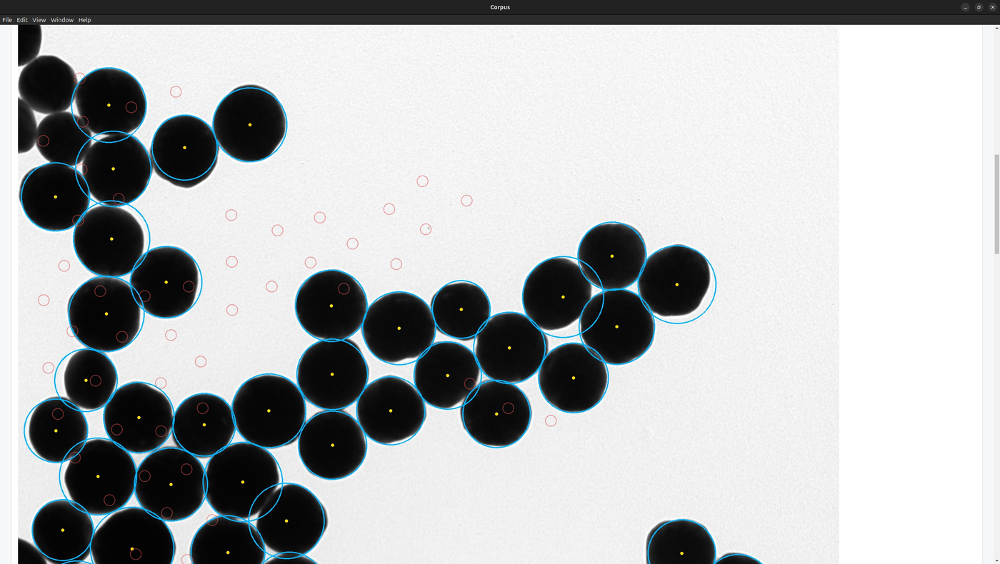
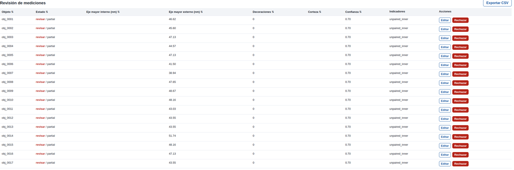
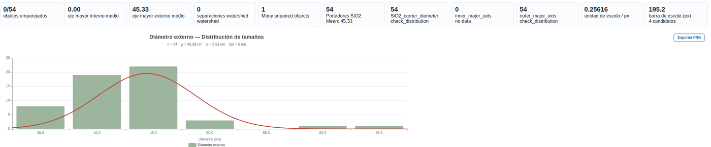

<div align="center">

# Corpus

**TEM nanoparticle metrology and dataset curation.**

`Load → Calibrate → Measure → Review → Export`

[](https://github.com/RxWhizz/Corpus/actions/workflows/ci.yml)
[](https://github.com/RxWhizz/Corpus/releases)
[](LICENSE)
[](https://www.python.org/)

</div>

---

Corpus is an open-source desktop application for measuring nanoparticles in TEM
images and for curating those images into an annotation-ready dataset. It pairs
an Electron interface with a Python/OpenCV measurement backend, and it is built
around one idea: **every number it reports should be traceable back to a scale
calibration, a settings record, and a human decision.**

Corpus does not replace expert review. It makes review fast, and it makes the
result reproducible.

| Measurement workspace | Review basket | Distribution summary |
|---|---|---|
|  |  |  |

---

## Key capabilities

**Classical measurement (no machine learning, works offline)**

- Manual scale-line calibration from the printed scale bar, with automatic
  detection offered as a starting point and always flagged as such.
- Shape presets for core-shell spheres, core-shell rods/pellets, decorated
  nanoparticles, and generic TEM particles.
- Watershed separation for touching round particles, off by default for rods
  where it tends to over-split.
- Segmentation Assist for dark particles, bright shells, and manual grey ranges.
- Particle filters for radius, circularity, elongation, edge exclusion, and hole
  handling.
- Measurement Basket for reviewing, editing, rejecting and exporting detections.
- Summary reports with counts, means, standard deviations, histograms, Gaussian
  reference curves, warnings, and the complete settings record.

**Dataset curation and AI preparation** — a separate subsystem, see
[AI dataset workflow](#ai-dataset-workflow)

- Source metadata, licence status, provenance, and checksums per image.
- COCO as the master annotation format; YOLO-seg exports derived from it.
- Deterministic, leakage-checked train/val/test splits.

**No AI model is required, bundled, or run.** See
[Hybrid AI readiness](#hybrid-ai-readiness).

---

## Installation

### Download a release (recommended)

Get the Windows installer or the Linux AppImage from
[Releases](https://github.com/RxWhizz/Corpus/releases). Python 3.10+ with
`opencv-python`, `numpy` and `pillow` must be available on the machine; the app
finds it via `PYTHON`, `python`, `python3` or `py -3`.

```bash
python -m pip install opencv-python numpy pillow requests pandas matplotlib
```

### Run from source — Linux

```bash
sudo apt update
sudo apt install -y nodejs npm python3 python3-pip git \
  libgtk-3-0 libnotify4 libnss3 libxss1 libxtst6 \
  xdg-utils libatspi2.0-0 libuuid1 libsecret-1-0

git clone https://github.com/RxWhizz/Corpus.git
cd Corpus
npm install
python3 -m pip install --user -r requirements.txt
PYTHON=python3 npm run start
```

### Run from source — Windows

Install [Node.js LTS](https://nodejs.org/) and
[Python 3.10+](https://www.python.org/downloads/windows/).

```powershell
git clone https://github.com/RxWhizz/Corpus.git
cd Corpus
npm.cmd install
python -m pip install -r requirements.txt
npm.cmd run start
```

If PowerShell blocks `npm.ps1`, use `npm.cmd`. If Python is somewhere unusual:

```powershell
$env:PYTHON="C:\Path\To\python.exe"
npm.cmd run start
```

### Build an AppImage

```bash
bash build-ubuntu.sh
env -u ELECTRON_RUN_AS_NODE PYTHON=python3 ./dist/*.AppImage
```

`env -u ELECTRON_RUN_AS_NODE` matters when launching from a VS Code terminal,
which sets that variable for its own Electron processes.

---

## Quickstart

Corpus ships with a demo dataset, so you can measure something in the first
minute without supplying any data.

**In the GUI**

1. Open **Particle Measurement** and choose **Easy**.
2. Load `Examples/demo_dataset/images/demo_001_core_shell_spheres.png`.
3. Sample type: **Core-shell spheres**.
4. Enter `100` as the printed scale length in nm.
5. Click **Mark Scale Line** and mark the two ends of the white bar, bottom right.
6. Click **Process Image**.
7. Review the overlay and the Measurement Basket. Edit or reject anything
   questionable — Corpus flags low-confidence objects for you.
8. Export CSV, or use `measurements.json` for downstream reporting.

Switch to **Advanced** when you need manual grey thresholds, circularity and
elongation filters, numbered overlays, or finer control over watershed.

**From the command line**

```bash
python measurement_modes.py \
  --image Examples/demo_dataset/images/demo_001_core_shell_spheres.png \
  --scale 100 --manual-scale-px 100 \
  --shape-preset spheres --mode both \
  --au-min-radius 5 --au-max-radius 40 \
  --sio2-min-radius 30 --sio2-max-radius 90
```

---

## Scientific workflow

```text
       ┌──────────┐   the printed bar sets nm/pixel; every
       │ Calibrate│   downstream number is a multiple of it
       └────┬─────┘
            │   nm_per_pixel = scale_nm / scale_pixels
       ┌────▼─────┐   threshold → morphology → optional watershed
       │ Segment  │   backend recorded on every detection
       └────┬─────┘
       ┌────▼─────┐   minAreaRect major/minor axes, area,
       │ Measure  │   circularity, aspect ratio, equivalent diameter
       └────┬─────┘
       ┌────▼─────┐   t_shell = (D_outer − D_core) / 2
       │ Derive   │   pairing status, ratio plausibility
       └────┬─────┘
       ┌────▼─────┐   confidence score + flags decide `ready`
       │ Review   │   vs `needs_review`. A human accepts.
       └────┬─────┘
       ┌────▼─────┐   measurements.json carries settings,
       │ Export   │   calibration, flags and a run fingerprint
       └──────────┘
```

Two properties are enforced rather than assumed:

- **Calibration is explicit.** An auto-detected bar always raises
  `Scale was auto-detected; manual scale is recommended`.
- **Nothing is silently discarded.** A particle Corpus is unsure about is
  emitted with flags and `review_status: needs_review`, never dropped.

### Reproducibility

Every run records a fingerprint binding the image bytes, the measurement
settings, and the Corpus version:

```json
"run_fingerprint": {
  "corpus_version": "1.0.0",
  "image_sha256": "…",
  "settings_sha256": "…"
}
```

Two runs with the same fingerprint produce the same measurements — this is
asserted by the test suite, end to end, on every CI run. Presentation-only
options such as the overlay style deliberately do **not** change the
fingerprint.

---

## Demo dataset

[`Examples/demo_dataset/`](Examples/demo_dataset/) holds six synthetic TEM
phantoms (512×512 PNG, CC0-1.0) covering core-shell spheres, low contrast,
touching particles, rods, decorated carriers, and a wide size spread.

They are synthetic on purpose: redistribution is unambiguous, the ground truth
is exact, and the whole set regenerates byte-for-byte from a fixed seed, which
makes it usable as a regression fixture.

```bash
python scripts/build_demo_dataset.py --check     # verify nothing drifted
python scripts/build_demo_expected.py --check    # verify measurements match
```

Expected results, with agreement against ground truth, are versioned in
[`Examples/demo_dataset/expected/`](Examples/demo_dataset/expected/README.md).

> Other files under `Examples/` are working images kept for manual testing.
> Their provenance is not established and they are **not** redistributable as
> Corpus data.

---

## Outputs

| File | Contents |
|---|---|
| `measurements.json` | complete record: settings, calibration, per-object measurements, flags, review status, warnings, distribution summaries, run fingerprint |
| `processed_image.jpg` | overlay with detections and review markers |
| `diameters.txt` | legacy compatibility output |

Generated outputs are git-ignored by default.

Each measured object carries: `object_id`, centre, inner/outer major and minor
axes in nm, `shell_thickness_estimate`, `inner_outer_ratio`, `pair_status`,
`review_status`, `confidence_score`, `separation_method`, `backend`, and `flags`.

---

## Validation

See **[`docs/validation/`](docs/validation/README.md)** for the harness, the
current results, and the honest gaps.

```bash
python -m corpus.validation --table my_table.csv --out docs/validation/pilot
```

It outputs CSV, JSON, a Markdown report, and publication-ready figures
(Corpus vs reference, residuals, Bland–Altman, error vs size), with MAE, RMSE,
bias, relative error, R² about the identity line, Pearson r, and explicit
recall/precision. Rows that cannot be compared are **counted and listed**, never
quietly dropped.

**Current status:** a [synthetic self-check](docs/validation/synthetic_selfcheck/report.md)
runs in CI and shows ~1.3% MAE on overall diameter at full recall against known
phantom geometry. **The pilot against expert manual/ImageJ measurements on real
TEM images has not been done** — it needs data this repository does not contain.
Do not cite the self-check as accuracy evidence.

---

## AI dataset workflow

Corpus prepares data for instance segmentation; it does not train or run a
model. The first target is Au@SiO2 core-shell TEM segmentation with two fixed
v0 classes: `0: Au_core`, `1: SiO2_outer`.

```text
curated images + metadata  →  COCO master  →  YOLO-seg export  →  audit  →  Colab bundle
                                  ▲
                        fine masks from CVAT / Label Studio
```

Guarantees enforced by the pipeline:

- COCO stays the master format; YOLO is always derived.
- Splits are content-addressed and deterministic — the same input yields the
  same splits, with no seed to forget.
- **Source-group leakage fails the audit.** Tiles from one micrograph cannot
  land in different splits.
- The manifest records source, checksum, licence, licence status, split, class
  counts, calibration state and annotation review state per image.
- Missing licence or provenance is surfaced explicitly, for every image.

```bash
npm run training:synthetic-bundle    # end-to-end smoke bundle
npm run training:package             # package from a CVAT COCO import
npm run training:audit               # audit a prepared dataset
```

See [`training/README.md`](training/README.md) and
[`docs/dataset_sources.md`](docs/dataset_sources.md).

---

## Hybrid AI readiness

Corpus v1.0 ships the *interface* for AI segmentation, not a model. Everything
downstream consumes a `SegmentationResult`, so a future backend can be added
without touching the measurement contract:

```python
from corpus.segmentation import get_backend

result = get_backend("classical").predict(image)
result.backend           # 'classical'  — recorded on every measurement
result.review_required   # False for deterministic classical output
```

The intended flow is deliberately not autonomous:

```text
AI proposes → Corpus displays → researcher reviews → accepted measurement
```

`review_required` defaults to `True`, so a backend that does not think about
review gets the safe behaviour. The classical path imports no ML runtime, and
the test suite asserts that.

---

## Limitations

- Classical measurement is a **pre-metrology tool**, not final truth for complex
  overlaps, low contrast, or ambiguous shells.
- **Low contrast is a real failure mode.** In the low-contrast demo phantom
  Corpus recovers the carriers but recovers **no cores at all**, and produces
  one false positive. It flags every object for review and warns
  `Low contrast` — but you must act on that warning.
- Corpus reads slightly **small** on soft edges (−1.4% on outer diameter, −6.4%
  on cores against synthetic ground truth), consistent with a threshold cutting
  inside a blurred boundary.
- Manual scale calibration is strongly recommended; auto-detection is a
  starting point and is always flagged.
- Watershed can over-split elongated particles, so it is off by default for
  rods/pellets.
- Radius windows are physical bounds, not universal defaults. The demo dataset
  sets them per image for exactly this reason.
- Gaussian curves are visual aids. Below 8 particles `measurements.json` reports
  `insufficient_n` rather than a distribution claim.
- Agreement with expert manual measurement on real TEM images is **not yet
  established**. See [Validation](#validation).
- Publication-quality datasets still need licence checks, metadata review, and
  manual annotation where masks are required.

---

## Relationship to other tools

Corpus implements workflows that are conventional in microscopy image analysis.
It is not a fork or port of any of the following, and redistributes none of them.

- **ImageJ/Fiji** — a broader, more mature general image-analysis environment.
- **CVAT / Label Studio** — better for manual mask annotation at dataset scale;
  Corpus hands off to them and imports the result.
- **Ultralytics** — better for trained segmentation, once enough annotated data
  exists.
- **Corpus** — aims to be the shortest path for curated TEM workflows where
  scale, metadata, review status and exportable measurements matter from the
  first screen.

---

## Development

```bash
python -m pip install -r requirements-dev.txt

pytest tests -q                     # 364 tests
ruff check .                        # lint
python -m corpus.dev.smoke          # end-to-end smoke: measurement, demo,
                                    # dataset pipeline, validation, backends
node --check main.js && node --check render.js
```

Or through npm: `npm test`, `npm run lint`, `npm run smoke`, `npm run check:node`.

### Layout

```text
corpus/            scientific core — importable and testable without Electron
  calibration/       nm/pixel from a scale bar
  segmentation/      binarisation, watershed, backend contract
  measurement/       contour geometry → calibrated particle records
  metrology/         core-shell derivations, distribution summaries
  review/            confidence scoring, review status, overlays
  io/                image decoding, exports, run provenance
  validation/        agreement metrics and reports
  dev/               the canonical smoke test
main.js, render.js, index.html   Electron shell
measurement_modes.py             measurement CLI used by the Electron process
corpus_pipeline/                 Corpus Builder: sources, curation, metadata
training/                        COCO → YOLO-seg → audit → Colab bundle
tests/                           pytest suite with synthetic fixtures
scripts/                         demo dataset, expected results, repo metadata
docs/validation/                 validation harness results
```

The scientific logic lives in `corpus/`; `measurement_modes.py` is a thin CLI
over it and re-exports the names it used to define, so existing imports keep
working. Migration of the remaining preset orchestration is ongoing — see
`CORPUS_EPIC_V1.md`, Workstream B1.

---

## Citation

If Corpus contributed to published work, please cite the software and state the
version and settings used. `measurements.json` contains everything needed,
including the run fingerprint.

```bibtex
@software{corpus,
  title  = {Corpus: TEM nanoparticle metrology and dataset curation},
  author = {{Corpus contributors}},
  year   = {2026},
  url    = {https://github.com/RxWhizz/Corpus},
  note   = {Version 1.0.0}
}
```

Report the preset, calibration method, filter settings and the fraction of
objects you accepted in review. Corpus is a measurement aid; the reported
numbers remain your responsibility.

---

## License and attribution

MIT — see [`LICENSE`](LICENSE).

Authorship, maintainership, third-party components and data provenance are set
out in [`AUTHORS.md`](AUTHORS.md).
